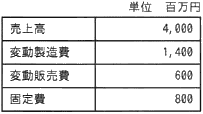

# 小テスト

## 10/4
テキストp2-20の改定シラバス、新キーワード解説から用語を5つ挙げてください  
挙げた5つの用語の意味を説明を行ってください

## 10/5

1. 企業活動において、CSRとは何ですか
1. 経営管理において、BCとは何ですか
1. 階層型組織/職能別組織とプロジェクト組織の違いを説明してください
1. 売上、費用、利益の関係を式で表してください
1. 財務状態の指標でROIとは何ですか

## 10/6

1. 経営戦略において、「ファブレス」とは何ですか
1. 経営戦略において、「TOB」とは何ですか
1. PPMにおいて、「負け犬」の製品に対して、どのような対応をすべきか？
1. ニッチマーケティングとは何ですか
1. 経営管理システムにおいて、CRMとは何ですか

## 10/11

1. 技術予想手法のデルファイ法とはどのような方法ですか
1. RFID(ICタグ)はどのようなことに利用されますか
1. ERPパッケージは何を実現するソフトウェアパッケージですか
1. 生産方式において、JIT(Just In Time)とはどのような方法ですか
1. 電子商取引の分類で、BtoEとはどのような取引ですか

## 10/12

1. 情報システム戦略において、SFAとは何ですか
1. 業務プロセスのモデリング手法のE-R図とは何ですか
1. ソリューションの形態で、ハウジングサービスとは何ですか
1. ディジタルディバイドとは何ですか
1. システムの調達の流れにおいて、RFPとは何ですか

## 10/13

1. ソフトウェア開発プロセスにおいて、要件定義とは何ですか
1. テスト手法において、ホワイトボックステストとブラックボックステスト  
の違いを説明してください
1. ソフトウェア保守において、回帰テスト(リグレッションテスト)とは  
何ですか
1. ソフトウェア開発モデルにおける、ウォータフォールモデルとは  
どのようなものですか。説明してください
1. 共通フレームにおいて、CMMIとは何ですか

## 10/18

1. ITILのサービスサポートのプロセスで、インシデント管理(障害管理)  
と問題管理の違いを説明してください
1. ITILのサービスデスク(ヘルプデスク)の役割を説明してください
1. ITILのSLAとは何ですか
1. ファシリティマネジメントにおいてUPSとは何ですか
1. 企業活動において内部統制とは何ですか

## 10/19

1. 10進数の22を2進数に基数変換してください
1. 2進数の10101100を10進数に基数変換してください
1. 単位の接頭語に関して以下のカッコを埋めてください
	- 1000Kバイト = 1( )バイト
	- 1000Gバイト = 1( )バイト
1. 単位の接頭語に関して以下のカッコを埋めてください
	- 0.001m秒 = 1( )秒
	- 0.001n秒 = 1( )秒
1. 文字コードとは何ですか

## 10/20

1. データ構造のスタックとはどのように動作しますか。説明してください
1. データ構造のキューとはどのように動作しますか。説明してください
1. 探索のアルゴリズムの二分探索法(バイナリサーチ)はどのように  
探索の処理を行いますか
1. 整列(ソート)のアルゴリズムのバルスソートはどのように  
ソートを行いますか
1. コンパイラ言語とインタプリタ言語違いを説明してください

## 10/25

1. プロセッサ(CPU)のバスとは何ですか
1. メモリのRAMとROMの違いを説明してください
1. ハードディスクの性能と信頼性向上のしくみで、ミラーリング  
とはなんですか
1. システム構成について、デュアルシステムとデュプレックスシステム  
の違いを説明してください
1. システムの利用形態について、リアルタイム処理とバッチ処理の違い  
を説明してください

## 10/26

1. システムの性能におけるレスポンスタイムとターンアラウンドタイム  
の違いを説明してください
1. 装置a1と装置a2のMTBFとMTTRが以下の通りである時、直列に接続した時の  
システムの稼働率はいくらか
1. 上記の装置a1と装置a2を並列に接続した時のシステムの稼働率はいくらか

|装置	|MTBF	|MTTR
|-------|------:|-------:
|a1	|160	|40
|a2	|170	|30

## 10/27

1. ヒューマンインタフェースについて、GUIとはなんですか  
CUIの違いを説明してください
1. Webデザインに関して、Webアクセシビリティとはデザインの際に  
どのような点を考慮するということですか
1. 光の3原色及び色の3原色を説明してください
1. RDBMSとはなんですか
1. リレーショナル型データベスのデータ操作において、  
選択/射影/結合をそれぞれ説明してください

## 11/1

1. ネットワークの構成で、LAN/WAN/インターネットの違いを  
説明してください
1. LANの構成で、イーサネットを説明してください
1. ネットワークを構成する機器で、ルータを説明してください
1. 通信プロトコルで、SMTPを説明してください
1. 人的脅威で、ソーシャルエンジニアリングを説明してください

## 11/2

1.次の損益計算資料を基に算出した損益分岐点の売上高は何百万円か。

2.CSRとは何ですか、説明してください  
3.コーポレートガバナンスとは何ですか、説明してください

## 11/8

1. 経営戦略の用語で、ベンチマーケティングとは何ですか
1. マーケティングのための分析手法で、RFM分析とは何ですか
1. ビジネス戦略立案及び評価のための情報分析手法で  
CSFとは何ですか
1. ビジネス戦略立案及び評価のための情報分析手法で  
VEとは何ですか
1. 経営管理システムにおけるナリッジマネジメントとは何ですか

## 11/9

1. 企業において、ビジネスモデルとは何ですか
1. 業務プロセスのモデリング手法でDFDとは何ですか
1. ソリューションの形態で、ホスティングサービスとは何ですか
1. データ活用において、データウェアハウスとは何ですか
1. システム化計画において、要件定義とは何ですか

## 11/10

1. ソフトウェア開発プロセスにおいて、機能要件とは何ですか
1. ソフトウェア開発プロセスにおいて、非機能要件とは何ですか
1. スパイラルモデルとはどのような開発モデルですか
1. プロトタイピングモデルとはどのような開発モデルですか
1. ソフトウェア開発プロセスのシステム設計において、外部設計と  
内部設計の違いを説明してください